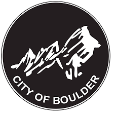

<div id="top"></div>
<!--
*** From https://github.com/othneildrew/Best-README-Template
*** Thanks for checking out the Best-README-Template. If you have a suggestion
*** that would make this better, please fork the repo and create a pull request
*** or simply open an issue with the tag "enhancement".
*** Don't forget to give the project a star!
*** Thanks again! Now go create something AMAZING! :D
-->


<!-- PROJECT SHIELDS -->
<!--
*** I'm using markdown "reference style" links for readability.
*** Reference links are enclosed in brackets [ ] instead of parentheses ( ).
*** See the bottom of this document for the declaration of the reference variables
*** for contributors-url, forks-url, etc. This is an optional, concise syntax you may use.
*** https://www.markdownguide.org/basic-syntax/#reference-style-links
-->
<!-- [![Contributors][contributors-shield]][contributors-url] -->
<!-- [![Forks][forks-shield]][forks-url] -->
<!-- [![Stargazers][stars-shield]][stars-url] -->
[![Issues][issues-shield]][issues-url]
[![License][license-shield]][license-url]


<!-- PROJECT LOGO -->
<br />
<div align="center">
  <a href="https://github.com/github_username/repo_name">
    
  </a>

<h3 align="center">City of Boulder Racial Equity Map (WIP)</h3>

  <p align="center">
    A map combining variables from the American Community Survey 5-year estimates (2016-2020) with city data to investigate demographic and economic differences across census block groups. (Target completion date: September 2022)
    <br />
    <!-- <a href="https://github.com/github_username/repo_name"><strong>Explore the docs »</strong></a>
    <br /> -->
    <br />
    <!-- <a href="https://github.com/github_username/repo_name">View Demo</a> -->
    <!-- · -->
    <a href="https://github.com/github_username/repo_name/issues">Report Bug</a>
    ·
    <a href="https://github.com/github_username/repo_name/issues">Request Feature</a>
  </p>
</div>


<!-- TABLE OF CONTENTS -->
<details>
  <summary>Table of Contents</summary>
  <ol>
    <li>
      <a href="#about-the-project">About The Project</a>
      <ul>
        <li><a href="#built-with">Built With</a></li>
      </ul>
    </li>
    <li>
      <a href="#getting-started">Getting Started</a>
      <ul>
        <li><a href="#prerequisites">Prerequisites</a></li>
        <li><a href="#installation">Installation</a></li>
      </ul>
    </li>
    <li><a href="#usage">Usage</a></li>
    <li><a href="#roadmap">Roadmap</a></li>
    <li><a href="#contributing">Contributing</a></li>
    <li><a href="#license">License</a></li>
    <li><a href="#contact">Contact</a></li>
    <li><a href="#acknowledgments">Acknowledgments</a></li>
  </ol>
</details>


<!-- ABOUT THE PROJECT -->
## About The Project

This project leverages data from the American Community Survey 5-year estimates (2016-2020) to develop a racial equity index map for the City of Boulder.

<p align="right">(<a href="#top">back to top</a>)</p>


### Built With

* [R](https://www.r-project.org/)

<p align="right">(<a href="#top">back to top</a>)</p>


<!-- GETTING STARTED -->
## Getting Started

### Prerequisites

<!-- This is an example of how to list things you need to use the software and how to install them. -->
* R version 4.2.0 or greater
* RStudio 2022.02.3 Build 492 or greater


### Installation

1. Clone the repo
   ```sh
   git clone https://github.com/cityofboulder/boulder_equity_map
   ```
2. Install packages
   ```sh
   install.packages("tidyverse")
   install.packages("stringr")
   install.packages("ggplot2")
   install.packages("tidygeocoder")
   install.packages("lubridate")
   install.packages("sf")
   install.packages("tidycensus")
   install.packages("tigris")
   install.packages("rosm")
   install.packages("tmap")
   install.packages("tmaptools")
   install.packages("OpenStreetMap")
   install.packages("data.table")
   # use type argument if working on Windows operating system
   # install.packages("devtools", type = "win.binary")

   # Load devtools to install nlcor package
   # library(devtools)

   # install_github("ProcessMiner/nlcor")

   ```
3. Get free Geocodio API at https://www.geocod.io/docs/#authentication.
4. Request a Census API key at https://api.census.gov/data/key_signup.html and add it to your environment as follows:
   ```sh
   library(tidycensus)
   census_api_key("YOUR API KEY GOES HERE")
   ```

<p align="right">(<a href="#top">back to top</a>)</p>


<!-- USAGE EXAMPLES -->
## Usage
<!-- 
Use this space to show useful examples of how a project can be used. Additional screenshots, code examples and demos work well in this space. You may also link to more resources. -->

<!-- _For more examples, please refer to the [Documentation](https://example.com)_ -->

<p align="right">(<a href="#top">back to top</a>)</p>


<!-- ROADMAP -->
## Roadmap

<!-- - [ ] Feature 1
- [ ] Feature 2
- [ ] Feature 3
    - [ ] Nested Feature -->

See the [open issues](https://github.com/cityofboulder/boulder_equity_map/issues) for a full list of proposed features (and known issues).

<p align="right">(<a href="#top">back to top</a>)</p>


<!-- CONTRIBUTING -->
## Contributing

<!-- Contributions are what make the open source community such an amazing place to learn, inspire, and create. Any contributions you make are **greatly appreciated**.
 -->
If you have a suggestion that would make this better, please fork the repo and create a pull request. You can also simply open an issue with the tag "enhancement".
<!-- Don't forget to give the project a star! Thanks again! -->

1. Fork the Project
2. Create your Feature Branch (`git checkout -b feature/AmazingFeature`)
3. Commit your Changes (`git commit -m 'Add some AmazingFeature'`)
4. Push to the Branch (`git push origin feature/AmazingFeature`)
5. Open a Pull Request

<p align="right">(<a href="#top">back to top</a>)</p>


<!-- LICENSE -->
## License

Distributed under the Creative Commons Zero v1.0 Universal License. See `LICENSE.txt` for more information.

<p align="right">(<a href="#top">back to top</a>)</p>


<!-- CONTACT -->
## Contact

Stewart LaPan - lapans@bouldercolorado.gov

Project Link: [https://github.com/cityofboulder/boulder_equity_map](https://github.com/cityofboulder/boulder_equity_map)

<p align="right">(<a href="#top">back to top</a>)</p>


<!-- ACKNOWLEDGMENTS -->
## Acknowledgments

* []()
* []()
* []()

<p align="right">(<a href="#top">back to top</a>)</p>


<!-- MARKDOWN LINKS & IMAGES -->
<!-- https://www.markdownguide.org/basic-syntax/#reference-style-links -->
<!-- [contributors-shield]: https://img.shields.io/github/contributors/github_username/repo_name.svg?style=for-the-badge
[contributors-url]: https://github.com/github_username/repo_name/graphs/contributors
[forks-shield]: https://img.shields.io/github/forks/github_username/repo_name.svg?style=for-the-badge
[forks-url]: https://github.com/github_username/repo_name/network/members
[stars-shield]: https://img.shields.io/github/stars/github_username/repo_name.svg?style=for-the-badge -->
<!-- [stars-url]: https://github.com/github_username/repo_name/stargazers -->
[issues-shield]: https://img.shields.io/github/issues/cityofboulder/boulder_equity_map.svg?style=for-the-badge
[issues-url]: https://github.com/cityofboulder/boulder_equity_map/issues
[license-shield]: https://img.shields.io/badge/License-CC0_1.0-lightgrey.svg?style=for-the-badge
[license-url]: https://github.com/github_username/repo_name/blob/master/LICENSE.txt